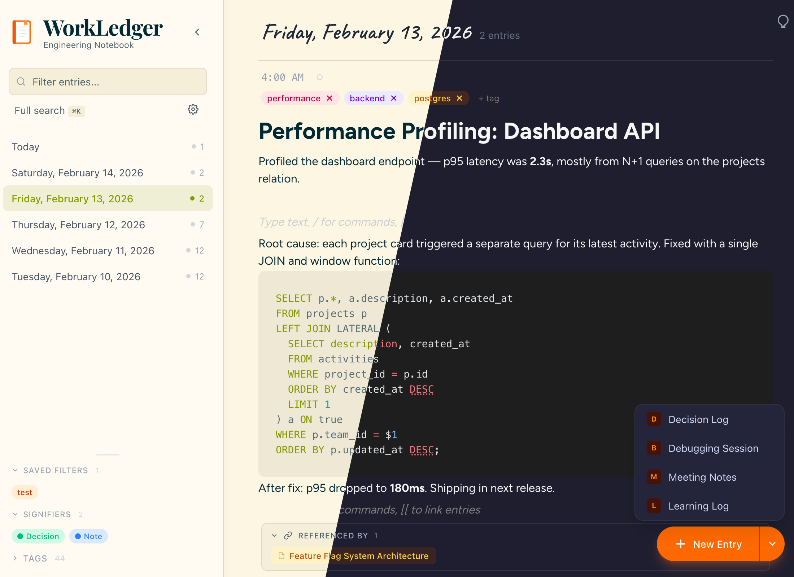

<p align="center">
  
</p>

<h1 align="center">WorkLedger</h1>

<p align="center">An open-source engineering notebook for documenting your daily work.<br>Built with React, BlockNote, and Excalidraw.</p>

<p align="center">
  <a href="https://github.com/gruberb/workledger/blob/main/LICENSE">
    
  </a>
  <a href="https://github.com/gruberb/workledger/actions">
    
  </a>
  <a href="https://github.com/gruberb/workledger/blob/main/CONTRIBUTING.md">
    
  </a>
  
  
  
</p>

<p align="center">
  
</p>

## Features

### Customize your workspace

- **5 theme presets** -- Light, Dark, Dracula, Catppuccin Mocha, and Solarized Light — each adapts the entire UI including syntax highlighting
- **7 font families** -- Figtree, Plus Jakarta Sans, DM Sans, Urbanist, Inter, JetBrains Mono, or Source Serif
- **Focus mode** -- Full-screen, distraction-free writing on a single entry
- **Progressive Web App** -- Install as a standalone app on any device, works offline

### Write and organize

- **Daily entries** -- Organized by day with timestamps, create entries with `Cmd+J`
- **Rich text editing** -- Powered by [BlockNote](https://blocknotejs.org/) with slash commands for headings, lists, code blocks, and more
- **Inline drawings** -- Embed [Excalidraw](https://excalidraw.com/) diagrams directly in your notes via `/drawing`
- **Syntax highlighting** -- 24 languages with Shiki, theme-aware code blocks
- **Wiki-style linking** -- Type `[[` to link between entries and build a knowledge graph
- **Backlinks** -- "Referenced by" panel below each entry shows all entries that link to it, auto-maintained on save
- **Entry templates** -- Start entries with structured sections: Decision Log, Debugging Session, Meeting Notes, Learning Log — each with pre-filled headings and auto-tags
- **Entry signifiers** -- Label entries as Note, Decision, Task, Question, or Idea with color-coded indicators; filterable in the sidebar
- **Pin entries** -- Pin important entries to the top of your stream
- **Tagging** -- Color-coded tags for categorization and filtering
- **Saved filters** -- Save tag + text filter combinations as named presets for one-click access
- **Search** -- Full-text search across all entries and tags (`Cmd+K`)

### Review your work

- **Weekly review** -- Toggle a weekly view that groups entries by ISO week with signifier breakdowns, top tags, and entry previews
- **Collapsible week cards** -- Most recent week auto-expanded, older weeks collapsed
- **Filtering in review mode** -- Text, tag, signifier, and saved filter all work in the weekly view

### Stay in control

- **Local-first** -- All data stored in IndexedDB, no server required
- **Optional server sync** -- End-to-end encrypted sync across devices. Use the default server or [self-host your own](https://github.com/gruberb/workledger-sync) — generate a sync ID, and your entries are encrypted before leaving the browser
- **Import & export** -- Export all entries as JSON for backup, import them back anytime
- **Archive & restore** -- Archive old entries to keep your workspace clean, browse and restore them anytime
- **Mobile-friendly** -- Responsive layout with touch-friendly controls
- **Keyboard-driven** -- `Cmd+J` new entry, `Cmd+K` search, `Cmd+\` toggle sidebar, `Escape` clear filter

### Optional: AI Notebook Companion

An optional AI sidebar with 12 concrete engineer actions. Off by default, zero impact on the core app when disabled. Easy to remove if unwanted — fork and delete `src/features/ai/` without affecting anything else.

**Quick start:**

1. Click the **gear icon** in the left sidebar and select **Enable AI**
2. **Configure a provider** — choose one:
   - **Ollama (local):** Install [Ollama](https://ollama.com/), run `ollama pull mistral`, done
   - **Hugging Face (remote):** Paste a free [API token](https://huggingface.co/settings/tokens) and pick a model
   - **Custom server:** Point to any OpenAI-compatible endpoint
3. Hover over a note and click the **lightbulb icon**
4. **Pick an action** from 4 categories:

| Category | Actions |
|----------|---------|
| **Summarize** | My Day, My Week, A Topic |
| **Generate** | Standup Update, PR Description, ADR from Notes, Draft Message |
| **Think** | Rubber Duck, Challenge My Thinking, Explore Tradeoffs |
| **Remember** | What Did I Decide About...?, When Did I Last Work On...? |

Actions support multi-entry context (day, week, or topic scope) and topic search.

<p align="center">
  
</p>

## Getting Started

```bash
git clone https://github.com/gruberb/workledger.git
cd workledger
npm install
npm run dev
```

Open [http://localhost:5173](http://localhost:5173) in your browser.

## License

MIT
